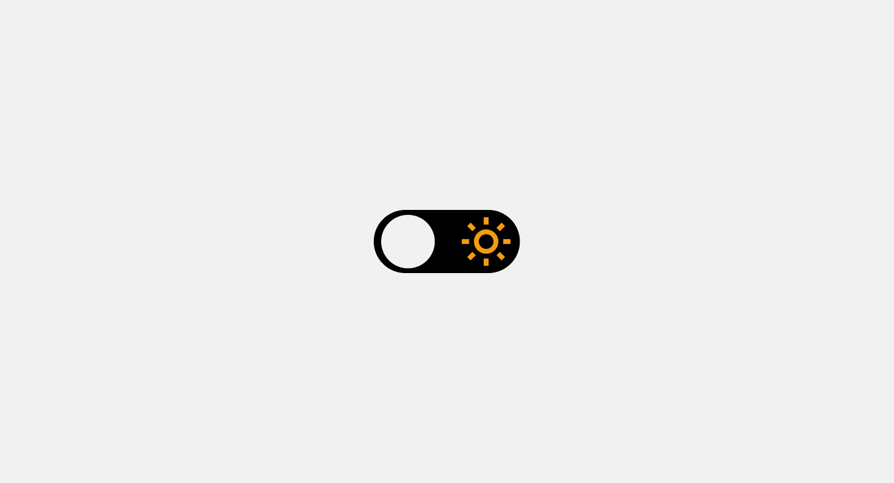
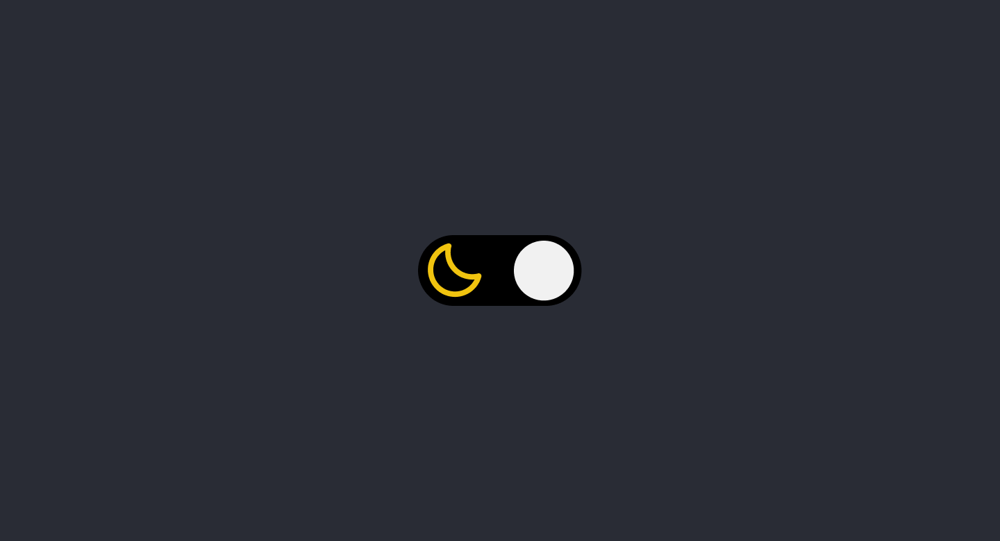

<h1 align="center">Theme Switcher</h1>

    Desafio: Theme Switcher by equipe Rocketseat 💜

    <a href="#-tecnologias">Tecnologias</a>&nbsp;&nbsp;&nbsp;|&nbsp;&nbsp;&nbsp;
    <a href="#-projeto">Projeto</a>&nbsp;&nbsp;&nbsp;|&nbsp;&nbsp;&nbsp;
    <a href="#-layout">Layout</a>

 

    

    

## 🚀 Tecnologias

Esse projeto foi desenvolvido com as seguintes tecnologias:

- HTML
- CSS
- JavaScript

## 💻 Projeto

Nesse desafio foi desenvolvido uma página que contem um toggle para alternar entre o tema dark e light.
OBS: A escolha do tema é salvo no Local Storage

## 📋 Layout 

Voce pode visualizar o layout do projeto atraves [DESSE LINK](https://www.figma.com/file/yJ0kcX1684XPoyJnUf1K6J/DD-Theme-Switcher/duplicate). E necessario ter conta no [Figma](https://figma.com) para acessa-lo.

---

Feito com 💜 by Phelipe Pereira :wave:
